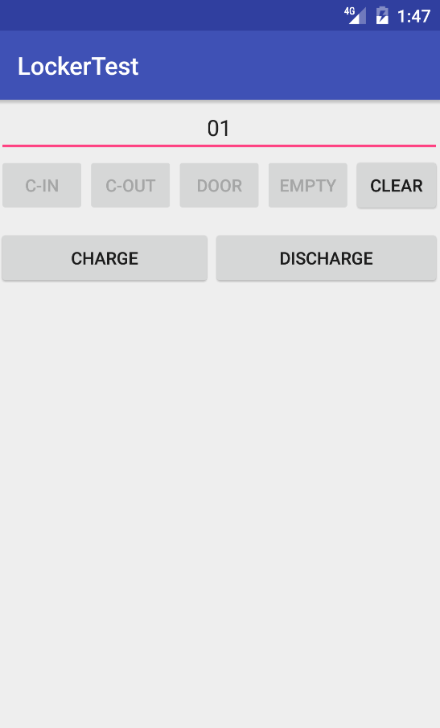

# Install
Build source with Android Studio.

# How to use

## Log Area
 show command issued and response from the board.
## Check in Command
Input door number and press C-IN button.
## Check out command
Input door number and press C-OUT button.
## Door state query
* Input door number and press DOOR button.
* if door number is empty, door state query for all boxes will be issued.
## Empty state query
* Input door number and press EMPTY button.
* if door number is empty, state query for all boxes will be issued.
